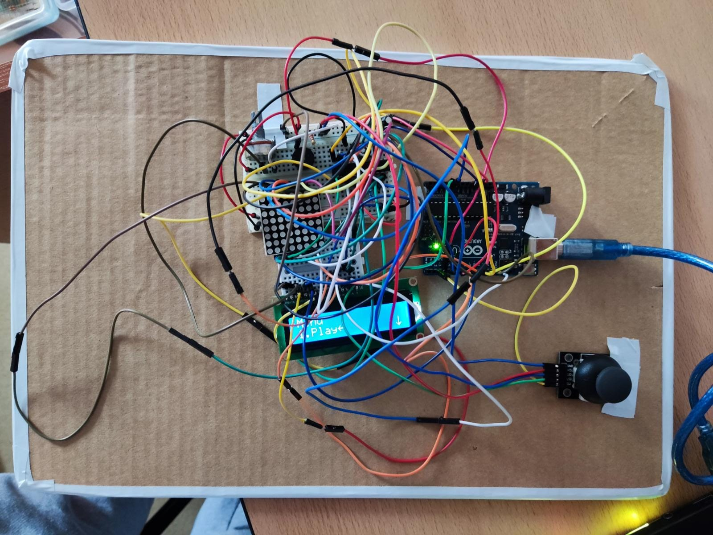

# Arduino_snake_game

## Backstory
Snake was among the first games I played as a child, so it will always remain in my heart. Therefore, when I had to implement a game on the 8x8 matrix, this was among the first that came to my mind.

## Game description
This game has 3 levels of difficulty:
<ul>
  <li> Easy :) - clasic snake, with a lower speed
  <li> Medium :/ - now the speed is medium
  <li> Hard :( - the speed will test your reflexes
</ul>  

## How to play
<ul>
  <li> You can choose your own settings
  <li> You can change the difficulty before start the game
  <li> Have fun playing the game and check the highscore
</ul> 

## Used components
<ul>
  <li> Matrix (8x8)
  <li> LCD display (16x2)
  <li> Joystick
  <li> Potentiometer
  <li> Buzzer
  <li> Resistors and wires
</ul>  

## Picture

## Video 
https://youtu.be/dYF81aN-I0Q
