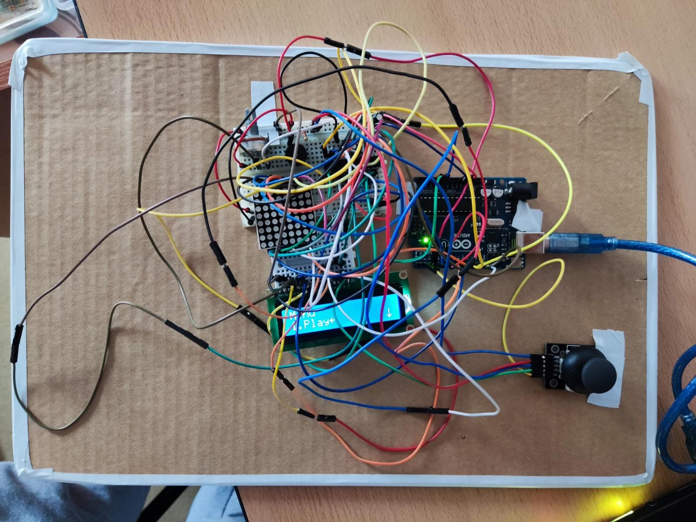

# 🐍 **Arduino Snake Game** 🎮✨

## Backstory 🌟
Snake was one of the very first games I played as a child, and it has always held a special place in my heart. When I was challenged to implement a game on an 8x8 matrix, the classic Snake immediately came to mind, blending nostalgia with modern creativity.

## Game Description 🔥🎯
Experience a timeless classic with three levels of difficulty:
- **Easy 🙂**  
  Enjoy the traditional Snake game with a slower pace. 🐢
- **Medium 😐**  
  Feel the challenge ramp up with a moderate increase in speed. 🚀
- **Hard 😟**  
  Test your reflexes with a fast-paced mode that pushes your limits. ⚡

## How to Play 🎮👉
- **Custom Settings:** Choose your preferred game settings before you start. ⚙️
- **Adjustable Difficulty:** Change the difficulty level to suit your skill and mood. 🔄
- **Aim High:** Play for fun and compete for the high score! 🏆🎉

## Used Components 🔌🛠️
- **8x8 LED Matrix:** Displays the game in action. 💡
- **16x2 LCD Display:** Shows game information and scores. 📟
- **Joystick:** Navigate the snake through the grid. 🕹️
- **Potentiometer:** Adjust settings as needed. 🔧
- **Buzzer:** Provides audio feedback during gameplay. 🎵
- **Resistors & Wires:** Ensure proper connectivity and circuit integrity. 🔩

## Visuals 
- **Project Setup Image:**  
  

- **Gameplay Video:**  
  [Watch on YouTube](https://youtu.be/dYF81aN-I0Q)
